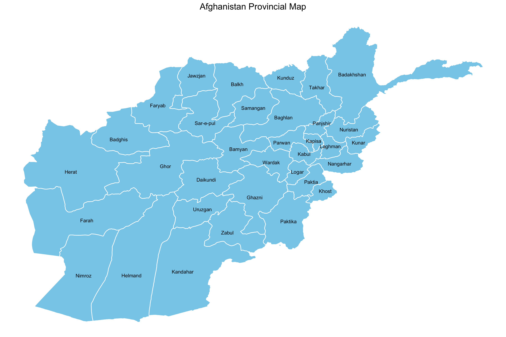

# Afghanistan Provincial Map in R

```
library(tidyverse)

map <- readRDS("afghanistan_provincial_map.RDS")

map %>% 
  ggplot(aes(x = long, y = lat, group = province)) +
  geom_polygon(col = "white", show.legend = T, fill = "skyblue") +
  geom_text(aes(x = position_x, y = position_y, label = province),
            size = 3) +
  theme_void() +
  theme(plot.title = element_text(hjust = 0.5, size = 15),
        legend.position = "bottom") +
  labs(title = "Afghanistan Provincial Map", fill = NULL)

ggsave("map.png", height = 8, width = 12)

```

