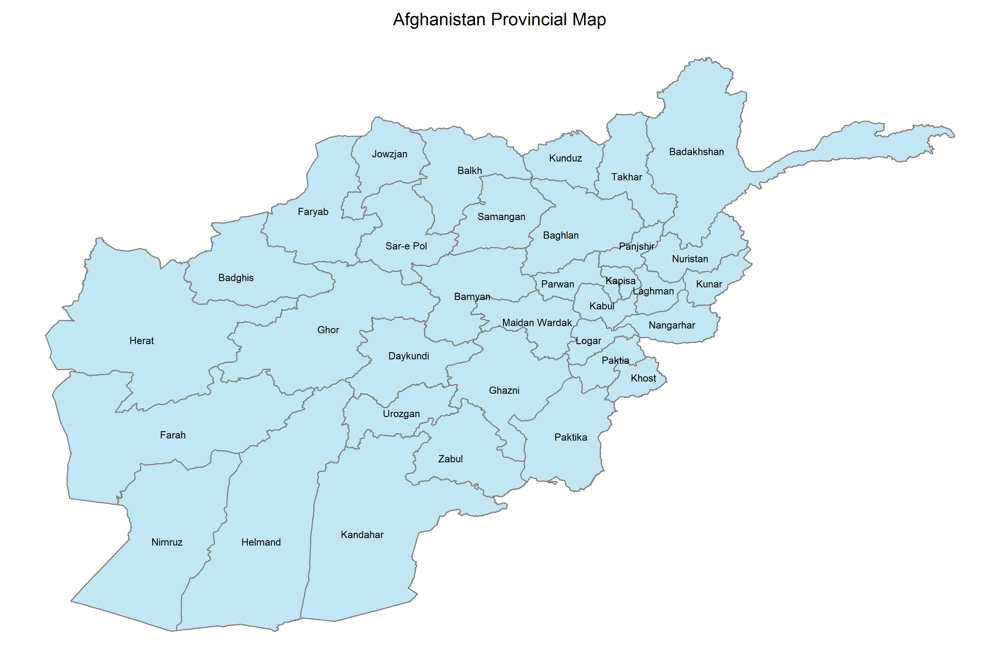
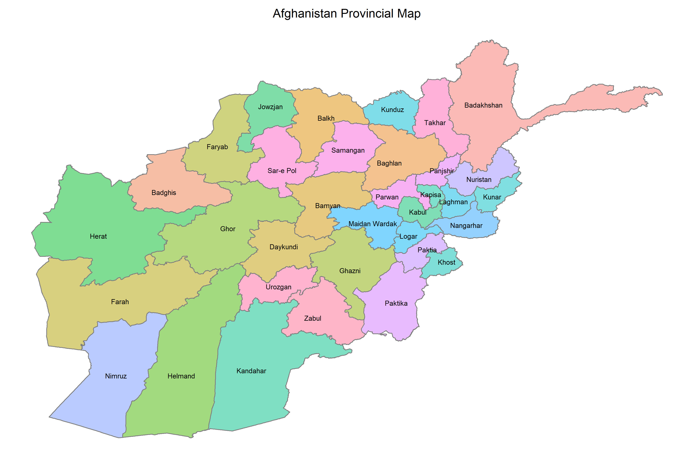

# Afghanistan Provincial Map in R


### loading required packages and the shape file
```
library(tidyverse)
library(sf)

unzip("afghan_province.zip")
map <- st_read("afghan_province.shp")
map <- full_join(map, read.csv("map_labels.csv"), by = c("prov" = "province"))
```

### Creating provincial map
```
map %>% 
  ggplot() +
  geom_sf(fill = "skyblue", color = "gray50", show.legend = F, alpha = 0.5) +
  geom_text(aes(position_x, position_y, label = prov), size = 3) +
  theme_void() +
  theme(plot.title = element_text(hjust = 0.5, size = 15)) +
  labs(title = "Afghanistan Provincial Map", fill = NULL) +
  NULL
  
ggsave("map_1.png", width = 12, height = 8)
```


### Fill each province with different color
```
map %>% 
  ggplot() +
  geom_sf(aes(fill = prov), color = "gray50", show.legend = F, alpha = 0.5) +
  geom_text(aes(position_x, position_y, label = prov), size = 3) +
  theme_void() +
  theme(plot.title = element_text(hjust = 0.5, size = 15)) +
  labs(title = "Afghanistan Provincial Map", fill = NULL) +
  NULL

ggsave("map_2.png", width = 12, height = 8)
```


